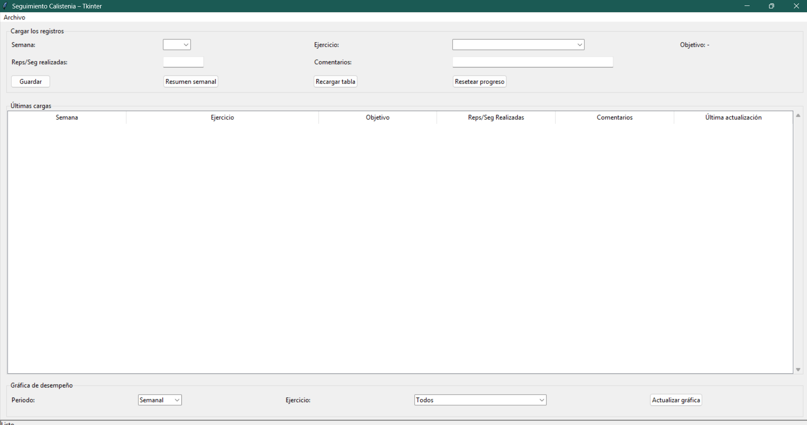

# 🏋️‍♂️ Seguimiento de Calistenia – Tkinter

Aplicación de escritorio desarrollada en **Python** con **Tkinter** para llevar un registro de entrenamientos de calistenia.  
Permite guardar tus progresos semana a semana, visualizar estadísticas mediante gráficos y resetear el seguimiento cuando quieras empezar desde cero.

---

## 📸 Capturas de pantalla

### Vista con datos cargados


### Vista inicial sin registros


---

## 🚀 Funcionalidades

- Registro semanal de ejercicios, repeticiones y comentarios.  
- Visualización de desempeño en gráficos dinámicos con **Matplotlib**.  
- Posibilidad de resetear el progreso y comenzar desde cero.  
- Exportación de datos en archivos locales.  
- Interfaz intuitiva construida con **Tkinter**.  
- Icono personalizado de calistenia incluido en `img/CalisWork.ico`.

---

## 🛠️ Tecnologías utilizadas

- **Python 3.x**
- **Tkinter** (interfaz gráfica)
- **Pandas** (manejo de datos)
- **Matplotlib** (gráficos)
- **PyInstaller** (empaquetado a .exe)

---

## 📂 Estructura del proyecto
```
EjercitaciónFisica/
│── app.py
│── interfaz.py
│── utils.py
│── requirements.txt
│── README.md
│
├── data/
│ └── progreso.csv
│
└── img/
├── CalisWork.ico
├── CalisWork Grafico.png
└── CalisWorkAPP.png
```

---

## ⚙️ Instalación y ejecución

1. **Clonar el repositorio:**
   ```bash
   git clone https://github.com/ezebellino/Seguimiento-Calistenia.git
   cd Seguimiento-Calistenia
   ```
2. **Crear entorno virtual e instalar dependencias:**

```bash
python -m venv venv
source venv/bin/activate   # En Linux/Mac
venv\Scripts\activate      # En Windows

pip install -r requirements.txt
```
---

3. **Ejecutar la aplicación:**

```bash
python app.py
```
## 📦 Empaquetado con PyInstaller
Si deseas generar un archivo ejecutable (.exe en Windows):

```bash
pyinstaller --onefile --windowed --icon=img/CalisWork.ico app.py
El ejecutable se generará en la carpeta dist/.
```
## ✨ Futuras mejoras
Exportar reportes en PDF.

Añadir más métricas de desempeño.

Modo oscuro para la interfaz.

Soporte multilenguaje.

## 👨‍💻 Autor
Desarrollado por Ezequiel Bellino
📍 Argentina

## 💪 "La disciplina supera la motivación"


